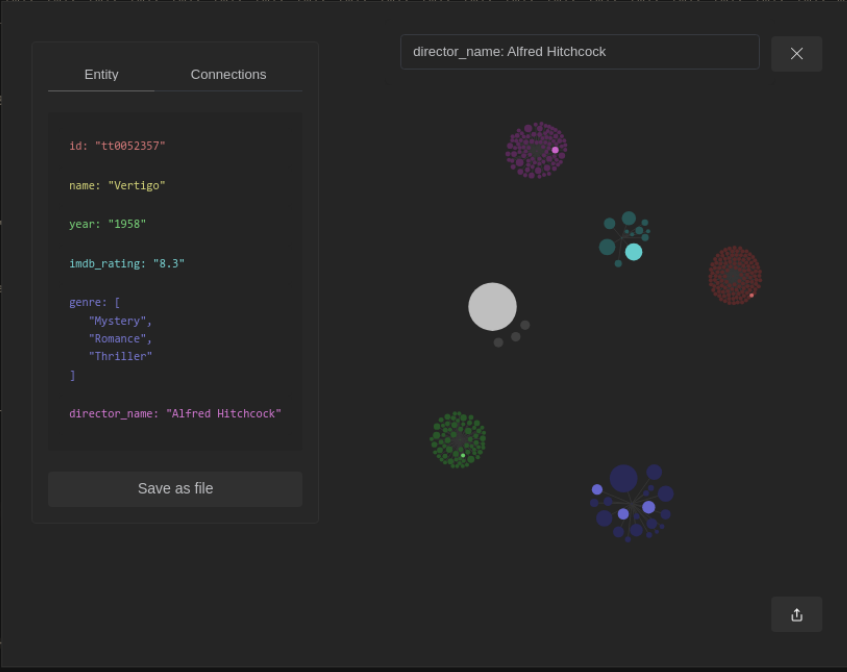
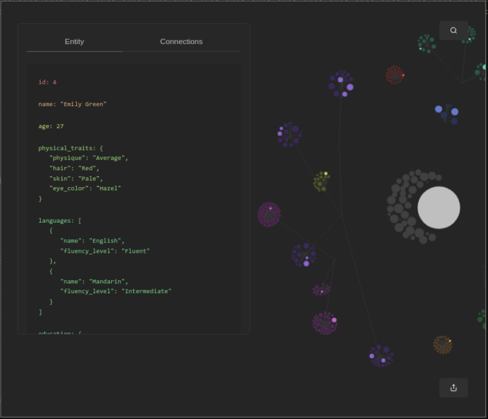
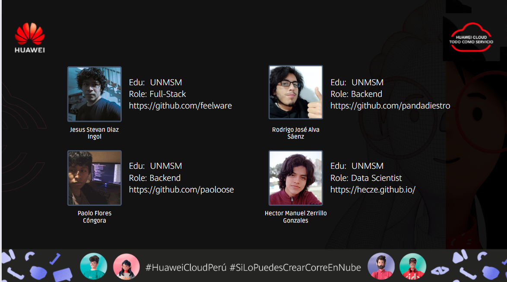

# Dandelion

Dandelion is a graph-based file manager designed to simplify data organization and sharing across teams. It supports multiple platforms and is ideal for system administrators and international marketing leaders.





## Background

Traditional data visualization methods focus on explicit connections. However, understanding datasets requires examining both explicit and implicit connections. Dandelion addresses this need by providing insights into the underlying relationships between nodes.

## Features

* **Graph-based Grouping System:** Visualizes data with graph representations.
* **Implicit Connection Exploration:** Reveals hidden or indirect relationships within datasets.
* **Relative Node Sizing:** Shows the significance of each element based on connections.
* **Color-coded Characteristics:** Uses colors to represent different characteristics.
* **User-friendly Interface:** Offers an intuitive environment for data management.
* **Cross-platform Support:** Ensures seamless operation across various operating systems.

## Technologies

* **Frontend:** React
* **Visualization:** D3-force
* **Database:** Redis, GaussDB
* **Backend:** Golang

## Installation

**1. Clone the repository**

```
git clone https://github.com/grep-fisi/dandelion.git
cd dandelion/src
```

**2. Install depencies:**

```
npm install
```

**3. Run the aplication**

```
npm run dev
```

## Usage


Once the application is up and running, you can start using the file manager by following these steps:

1. **Open the application:**
   Launch the application using the command above.
2. **Navigating the Interface:**

   * Use the dashboard to view your files.
   * Utilize the search bar to find files quickly.
   * Explore the graph view to see file relationships.
3. **Managing Files:**

   * Drag and drop files to organize.
   * Use the context menu for file operations such as move, delete, and rename.

## Acknowledgements

This project was funded by Huawei as part of the Huawei LATAM 2023 competition, where it reached the semifinals in China. The competition was highly selective, allowing only two representative groups per university across Latin America. Our team from the National University of San Marcos, one of Peru's most prestigious universities, was the only team from our institution to pass the tests and advance to the semifinals. We extend our gratitude to Huawei for their support and to our university for their encouragement.

## Team

Jesus Stevan Diaz Ingol: [https://github.com/feelware](https://github.com/feelware)

Paolo Flores Cóngora: [https://github.com/paoloose](https://github.com/paoloose)

Rodrigo José Alva Sáenz: [https://github.com/pandadiestro](https://github.com/pandadiestro)

Hector Manuel Zerrillo Gonzales: [https://github.com/Hecze](https://github.com/Hecze)


